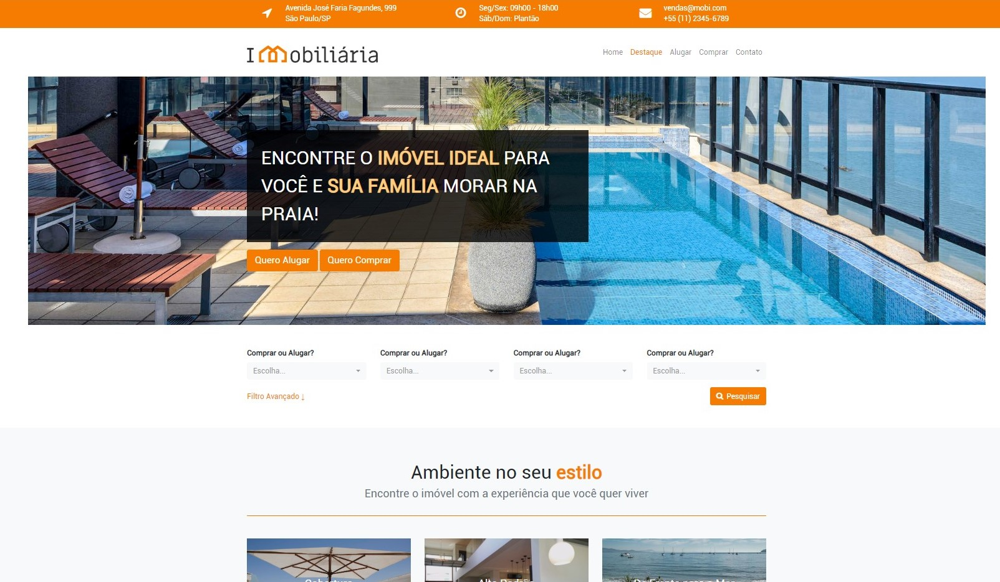

# Bootstrap Project

This project is for a source of studies related to the [bootstrap library](https://getbootstrap.com.br/).

### Demo

### Important

After cloning the repository, run the command: `npm i` or `yarn` to install the dependencies.

### Optional

We use the library [SASS](https://sass-lang.com/install) to process style sheets. If you want to modify the styles, 
we recommend using them.

---

### Roadmap
- #### Front End
- [ ] Create Home Page
- [ ] Create Highlight
- [ ] Create Rent
- [ ] Create Buy
- [ ] Create Contact

- #### Back End
- [ ] Configure Node.js, Express and EJS
- [ ] Separate header into single file
- [ ] Create one .ejs file for each page